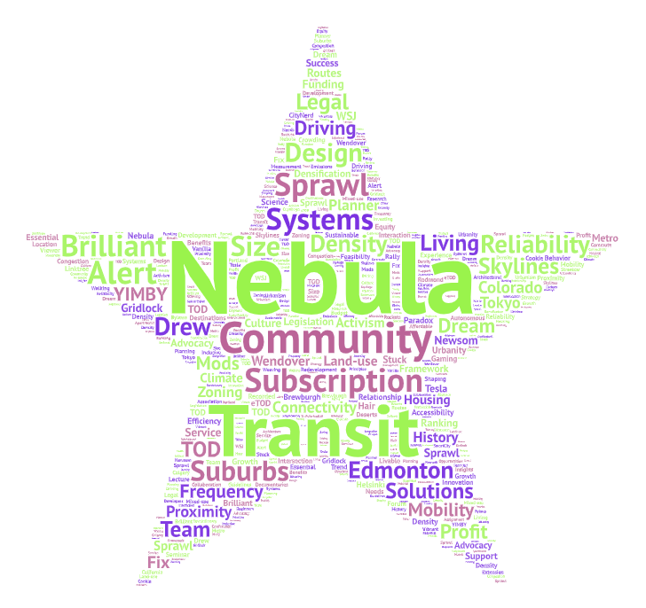
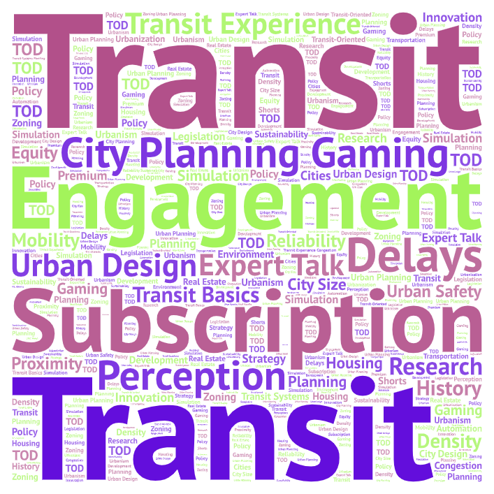

# GEOGG3582: Urban Density and Public Transit - YouTube Content Analysis

## Research Narrative

### 1. Topic and Search Parameters

**Topic:** The relationship between urban density and public transportation.

**Search Parameters Used:**
- **Primary Search Term:** "density public transit"
- **Platform:** YouTube
- **Data Collection Date:** January 21, 2026
- **Number of Videos Analyzed:** 70 videos
- **Video Sources:** Educational channels (RMTransit, CityNerd, Urban Planner Explained), news outlets (CNBC, PBS), and gaming/simulation content (Cities: Skylines)
- **Content Types:** Long-form videos, shorts, podcasts, and news segments
- **Time Range of Videos:** Historical content ranging from 6 years ago to 1 day old

### 2. Why this comparison

This research was conducted to understand the key words that make up the dicourse around
density in cities across the world. As well as to illustrate the key role that public transportation has in fostering and supplementing urban communities around the globe.

### 3. Word Cloud Analysis: Patterns and Observations

### 4. Possible Reasons for Observed Patterns

**Why "Density" and "Transit" Dominate:**
- These are the exact search terms used, so their prominence is expected; however, their overwhelming size indicates these concepts are synonymous in the discourse.

**Why "Systems" and "Design" Are Prominent:**
- Design-focused language suggests an urban planning perspective
- This reflects growing public interest in urban design as a solution to modern city problems

**Geographic Concentration (Edmonton, Toronto, Tokyo):**
- **Edmonton:** Recent policy initiatives around transit-oriented development make it topical
- **Tokyo:** Presented as the gold standard for dense, efficient transit systems
- These examples suggest content creators use case studies to illustrate concepts

**The Prominence of "Housing" and "Solutions":**
- Recent regulatory changes have made housing-transit connections newsworthy
- Content creators frame transit density as a solution to housing affordability crises

**Why "Sprawl" Appears:**
- Conversations about density inherently contrast with sprawl as the alternative
- This suggests framing density as the antidote to suburban sprawl

### 5. Future Research Improvements

1. **Temporal Analysis:** Track how terminology evolves over time by analyzing content from different years separately

2. **Compare Platforms:** Extend analysis to TikTok, Reddit, or Twitter to see if terminology differs by platform

3. Track video recommendations to see how algorithms cluster this content

### 6. Unexpected Findings and Key Takeaways

**Surprising Elements:**

 **Gaming Content is Significant:** Multiple Cities: Skylines videos appear in the results. This reveals that urban planning discourse exists in gaming communities, suggesting these concepts have reached mainstream audiences.

**Key Insight:** The discourse has evolved from whether density + transit works to HOW to implement it effectively. The abundance of "solutions," "design," and "planning" language suggests a professional maturation of this conversation.

---

### Word Cloud Visualizations

**Word Cloud 1 - Horizontal Format:**

**Word Cloud 2 - Square Format:**

---

## Data Download

**Research Data (CSV):** [Download videos (1).csv](https://github.com/maxfr/GEOGG3582/blob/main/videos%20(1).csv)
